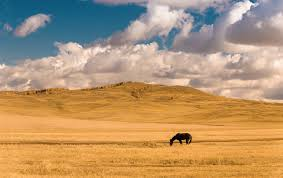
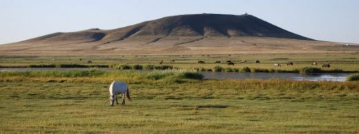
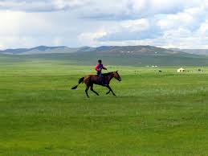
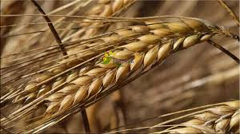
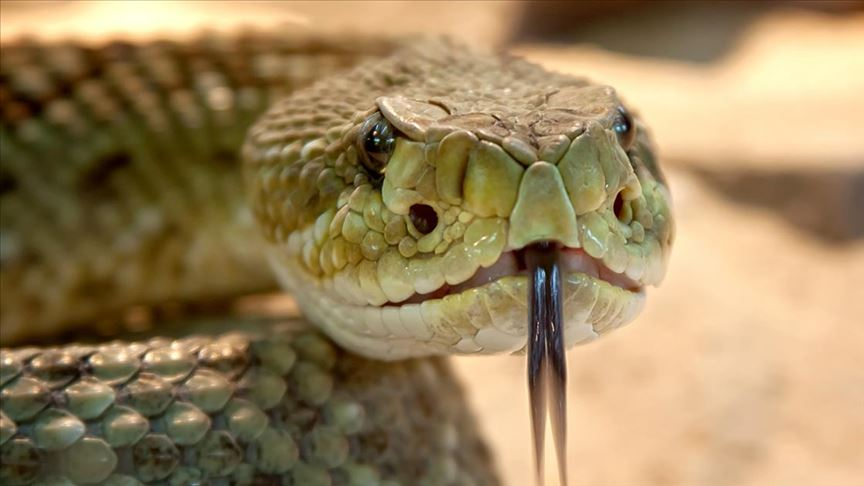
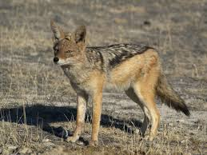

<!DOCTYPE html>
<html lang="tr">
<head>
  <meta charset="UTF-8">
  <title>Karasal İklim</title>
  
  <link href="https://fonts.googleapis.com/css2?family=Roboto:wght@400;500;700&display=swap" rel="stylesheet">
</head>
<body>

<header>
  <h1>Karasal İklim</h1>
</header>

<nav>
  <a href="#" onclick="showSection('iklim')">İklim Özellikleri</a>
  <a href="#" onclick="showSection('bitki')">Bitki Türleri</a>
  <a href="#" onclick="showSection('hayvan')">Hayvan Türleri</a>
  <a href="#" onclick="showSection('foto')">Fotoğraflar</a>
</nav>

<section id="iklim" class="active">
  <h2>Karasal İklim Özellikleri</h2>
  
Karasal iklim, deniz etkisinden uzak iç bölgelerde görülür. Yazları sıcak ve kurak, kışları ise soğuk ve kar yağışlıdır. Sıcaklık farkları çok fazladır. Yıllık yağış miktarı azdır. Özellikle gece ve gündüz sıcaklıkları arasında büyük farklar vardır. Bitki örtüsü genellikle bozkırdır. Bu iklimin en belirgin özelliklerinden biri de ani sıcaklık değişimlerinin ve uzun kışların etkisiyle biyolojik çeşitliliğin sınırlı olmasıdır.

  
  
</section>

<section id="bitki">
  <h2>Karasal İklimde Bitki Türleri</h2>
  
Karasal iklimin hakim olduğu bölgelerde doğal bitki örtüsü bozkırdır. Bozkırlar, yazın kuruyan, ilkbaharda yeşeren ot topluluklarıdır. Bu bölgede yer alan çalı türleri, bitki çeşitliliği açısından oldukça önemlidir. Kuraklığa dayanıklı çalılar, kısa boylu otlar ve yer yer çam ormanları görülür. Çalı biyomu, bu iklimde daha belirgindir, özellikle Doğu Anadolu gibi bölgelerde yoğunlaşan çalı türleri, bölgenin iklim koşullarına uyum sağlamış türlerden oluşur. Karasal iklimin bitki çeşitliliği, daha fazla tür barındırmakla birlikte, ekstrem iklim koşulları nedeniyle bu çeşitliliğin sürdürülebilirliği sınırlıdır. Stepler ve yüksek yerlerde ise orman kalıntıları, biyolojik çeşitliliğin bir göstergesi olarak yer alır.

  
  
</section>

<section id="hayvan">
  <h2>Karasal İklimde Hayvan Türleri</h2>
  
Karasal iklimde biyolojik çeşitlilik, bitki örtüsündeki kısıtlamalardan dolayı genellikle düşük olsa da, yine de çeşitli hayvan türlerine ev sahipliği yapar. Bu bölgede yaşayan hayvanlar genellikle soğuk ve kurak koşullara dayanıklıdır. Yaban tavşanı, tilki, kurt, geyik, vaşak gibi memeliler; doğan, kartal gibi yırtıcı kuşlar yaygındır. Bu türler, biyolojik çeşitliliğin azalmasına rağmen belirli alanlarda hâlâ sürdürülebilir bir yaşam alanı bulabilmektedir.

  
  
</section>

<section id="foto">
  <h2>Tüm Fotoğraflar</h2>
  

    
    
    
    
    
    
  

</section>

<footer>
</footer>

</body>
</html>
